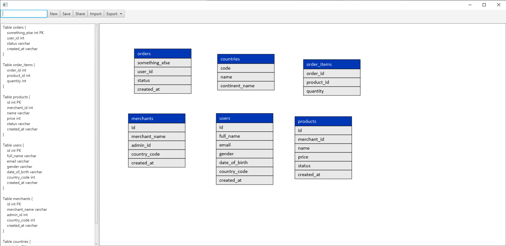

<h1>DataBaseMarkupLanguage Visualizer</h1>
<h3>Note 1: Currently facing issues with actual interactiveness</h3>
<h3>Note 2: Current syntax for constructing basic tables can be correctly parsed</h3>

<h3>missing syntax for ENUM and REF</h3>
Correct First and Follow sets of grammar: http://hackingoff.com/compilers/predict-first-follow-set

  <h4>CONTAINERS -> CONTAINER | CONTAINER CONTAINERS</h4>
  <h4>CONTAINER -> TABLE | ENUM | REF | EPSILON</h4>
  <h4>TABLE -> Table name { TABLE_CONTENT }</h4>
  <h4>TABLE_CONTENT -> TABLE_ROW | TABLE_ROW TABLE_CONTENT | EPSILON</h4>
  <h4>TABLE_ROW -> name TYPE | name TYPE pk | name ENUM_TYPE</h4>
  <h4>ENUM -> Enum ENUM_TYPE { ENUM_CONTENT }</h4>
  <h4>ENUM_CONTENT -> ENUM_ROW | ENUM_ROW ENUM_CONTENT</h4>
  <h4>ENUM_ROW -> name [ note: name ]</h4>
  <h4>REF -> ref</h4>
